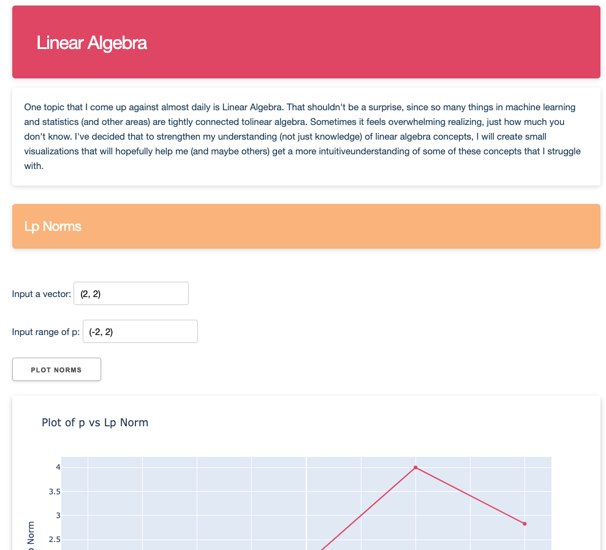

# Eigenvo - A math playground

I did math and physics back in college and I thought I knew what was going on (I didn't). However,
I did not realize that until recently, when I began working as a data scientist at Proton AI. Suddenly, I felt like I actually new 
nothing and I decided I was going to change that.

For me, the best way to learn is not to just solve a couple of text book problems, but to
take something and implement it or apply it, that is when I find out all those things I actually 
have no idea about. At the same time, I am continuously trying to improve my knowledge of programming and numerical computing.
So I decided to try something.

In this "math playground", I will follow a book called **Essential Math for Data Science by Hadrien Jean**
and for topics I find particularly interesting or challenging I will try to somehow implement them in Python
 and at the same time create some (hopefully) nice-looking interactive plots with Dash. 

Gradually, I aim to build up a library of topics from mathematics that I, or anyone else,
can look at, play around with and hopefully improve their understanding of the underlying concepts.

This site is no running via Google Cloud Run and can be accessed at [https://eigenvo.com](eigenvo.com)).
It's a bit slow at the moment, but I am working on speeding that up while keeping my costs low :)


### Running locally

If someone happens to come across this and wants to run this locally, I've put things 
into Docker containers, so you should be able to get this up and running pretty quickly.

Just run 

```bash
git clone https://github.com/djvaroli/eigenvo.git eigenvo/
```

to clone the repo, and if you have docker installed you can run

```bash
cd eigenvo && docker-compose up
```

It will then be accessible on at localhost:80, assuming it is free.


### What it looks like
Here's a screenshot of what it looks like at the current moment.

